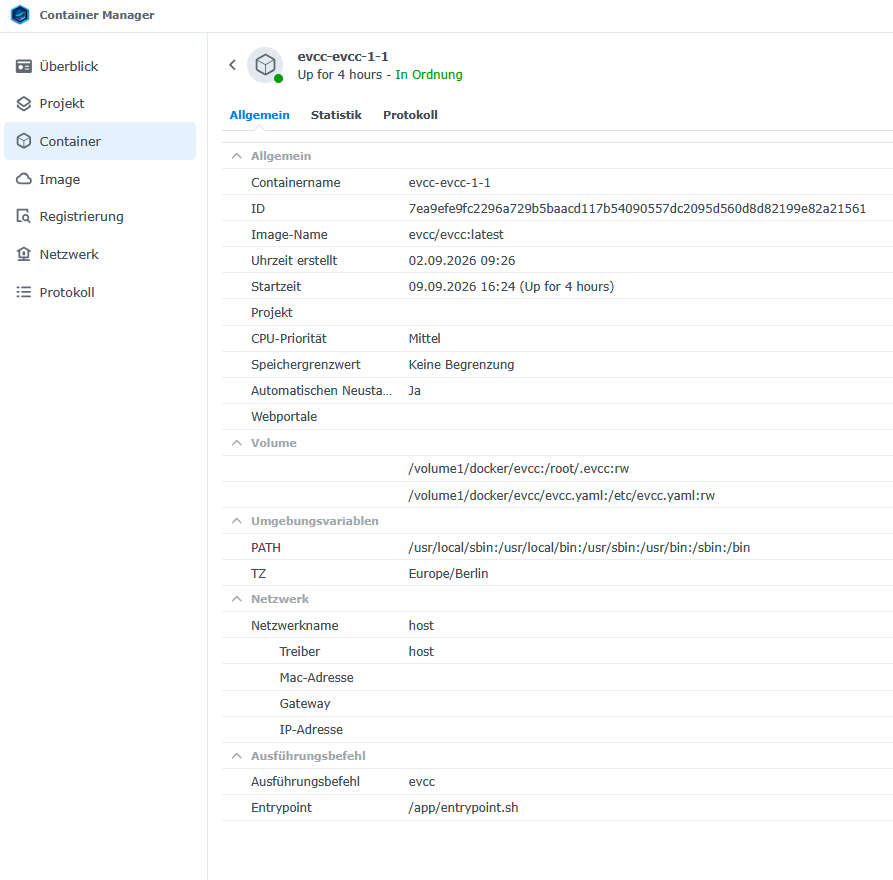
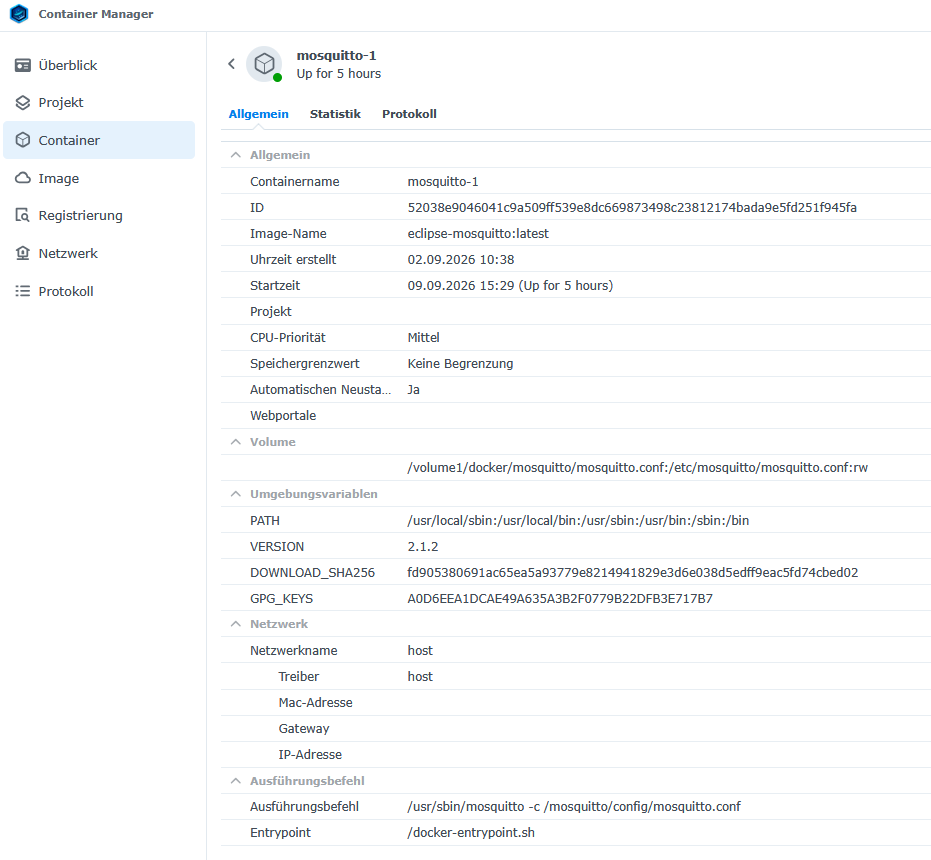
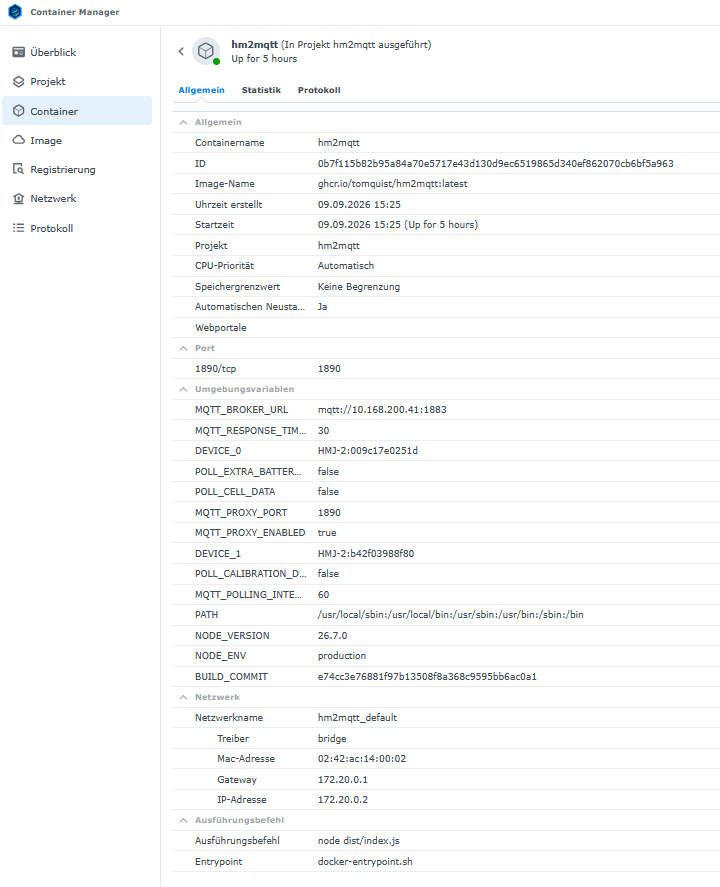
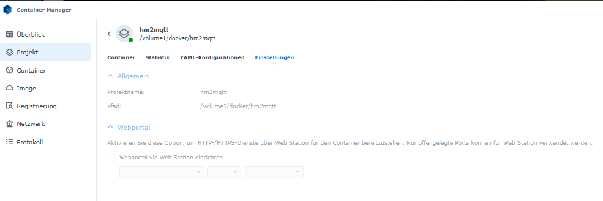

# Synology: evcc, Mosquitto und hm2mqtt mit Marstek B2500D

Stand: 9. September 2026. IP und MACs in den folgenden Textbeispielen sind Beispielwerte; die Screenshots zeigen den ursprünglichen Anlagenstand. Diese Anleitung basiert auf den Projektdateien und den vier Screenshots. Sie richtet die Anzeige der Speicherwerte in evcc ein. Eine aktive Steuerung der Lade-/Entladeleistung ist mit den vorhandenen benutzerdefinierten Zählern noch nicht eingerichtet.

## Überblick

```text
B2500D → NAS:1890 (hm2mqtt-Proxy) → NAS:1883 (Mosquitto)
                                      ↕
                                   hm2mqtt
                              Rohdaten → JSON
                                      ↓
                                  Mosquitto → evcc → Browser NAS:7070
```

Proxy und Datenverarbeitung gehören zum selben hm2mqtt-Container. Insgesamt werden drei Container benötigt.

| Bestandteil | Einstellung |
|---|---|
| NAS-IP | 192.168.1.10 – bei anderer Anlage überall ersetzen |
| evcc | Host-Netzwerk; Browserzugriff TCP 7070 |
| Mosquitto | Host-Netzwerk; MQTT TCP 1883 |
| hm2mqtt | Host-Netzwerk gemäß Projektdatei; Proxy TCP 1890 |
| Speicher | MQTT-Ziel NAS-IP:1890 |
| evcc, hm2mqtt, MQTT Explorer | Broker NAS-IP:1883 |

Voraussetzungen: Synology mit Container Manager und passender CPU-Architektur für die Images, feste NAS-IP/DHCP-Reservierung sowie WLAN-Verbindung der Speicher mit Zugang zur NAS. In der DSM-Firewall die Ports für die beteiligten lokalen Geräte zulassen. Die Ports dürfen nicht bereits belegt sein.

Im Host-Netzwerk keine zusätzlichen Portzuordnungen eintragen. Container-Namen sind hier keine automatisch nutzbaren DNS-Namen; daher verwenden die Beispiele die NAS-IP.

Die Grundinstallation übernimmt den passwortlosen Broker aus dem Projekt. Sie ist für ein vertrauenswürdiges, abgeschottetes Heimnetz gedacht. Keine Router-Portfreigaben für MQTT einrichten. Unterschiedliche MQTT-Benutzernamen allein sind kein Zugriffsschutz.

## 1. Ordner auf der Synology erstellen

In File Station den gemeinsamen Ordner `docker` öffnen bzw. erstellen und diese Struktur vorbereiten:

```text
/volume1/docker/
├── evcc/
│   └── evcc.yaml
├── mosquitto/
│   └── mosquitto.conf
├── hm2mqtt/
│   └── docker-compose.yml
└── logs/
```

Bei einem anderen Volume alle `/volume1`-Pfade ändern. Alternativ über PuTTY:

```sh
sudo mkdir -p /volume1/docker/evcc /volume1/docker/mosquitto /volume1/docker/hm2mqtt /volume1/docker/logs
```

Die Projektdatei `evcc.yaml` nach `/volume1/docker/evcc/evcc.yaml` und `mosquitto.conf` nach `/volume1/docker/mosquitto/mosquitto.conf` hochladen. `hm2mqtt.yaml` dient als Compose-Vorlage in Schritt 4.

Die Konfigurationsdateien müssen vor dem Containerstart als **Dateien**, nicht als gleichnamige Ordner existieren. Als UTF-8 speichern; YAML mit Leerzeichen statt Tabulatoren einrücken.

## 2. evcc installieren – Screenshot 1

1. In **Container Manager → Registrierung** `evcc/evcc:latest` herunterladen.
2. Unter **Image** auswählen und **Ausführen** wählen.
3. Containername beispielsweise `evcc-evcc-1-1`, automatischen Neustart aktivieren.
4. Netzwerk **host** wählen; keine Portzuordnung nötig.
5. Diese Mounts hinzufügen. Für die YAML-Datei **Datei hinzufügen**, für das Verzeichnis **Ordner hinzufügen** verwenden:

| NAS-Pfad | Container-Pfad | Berechtigung |
|---|---|---|
| /volume1/docker/evcc | /root/.evcc | Lesen/Schreiben |
| /volume1/docker/evcc/evcc.yaml | /etc/evcc.yaml | Lesen/Schreiben wie Screenshot; nur Lesen genügt für diese Dateikonfiguration ebenfalls |

Das Verzeichnis bewahrt die interne Datenbank dauerhaft auf. Die Datei enthält die Gerätekonfiguration. Siehe [evcc: Docker](https://docs.evcc.io/de/installation/docker/).

6. Umgebungsvariable `TZ=Europe/Berlin` setzen.
7. Vom Image vorgegebene Variablen, Startbefehl und Entrypoint übernehmen.
8. Einstellungen übernehmen. Solange Mosquitto noch nicht läuft, sind MQTT-Verbindungsfehler zu erwarten. Den abschließenden Start nach Schritt 5 durchführen.

Späterer Browserzugriff: [http://192.168.1.10:7070](http://192.168.1.10:7070). Web Station wird nicht benötigt. Die Beispiele verwenden `latest` wie die Screenshots; für spätere Updates eingesetzte Versionen dokumentieren und Konfiguration/Datenbank sichern.



## 3. Mosquitto installieren – Screenshot 2

**Korrektur:** Der Screenshot mountet nach `/etc/mosquitto/mosquitto.conf`, der Startbefehl liest aber `/mosquitto/config/mosquitto.conf`. Das Mount-Ziel muss zum Startbefehl passen. Für den Standardstart des offiziellen Images deshalb `/mosquitto/config/mosquitto.conf` verwenden. Quelle: [offizielles Mosquitto-Image](https://hub.docker.com/_/eclipse-mosquitto).

Die hochgeladene Konfiguration so ergänzen:

```conf
listener 1883
allow_anonymous true
allow_zero_length_clientid true
max_keepalive 120

# Container-Protokoll und docker logs
log_dest stdout
log_type error
log_type warning
log_type notice
log_type information
connection_messages true
```

Die ersten vier Einstellungen stammen aus dem Projekt; die Log-Einstellungen sind Ergänzungen. Eine persistente MQTT-Datenbank wird hier nicht eingerichtet. Nach einem Broker-Neustart müssen Geräte neue Werte senden.

1. `eclipse-mosquitto:latest` herunterladen und ausführen.
2. Containername `mosquitto-1`, automatischen Neustart aktivieren.
3. Netzwerk **host**, keine Portzuordnung.
4. Diesen Datei-Mount hinzufügen:

| NAS-Datei | Datei im Container | Berechtigung |
|---|---|---|
| /volume1/docker/mosquitto/mosquitto.conf | /mosquitto/config/mosquitto.conf | Lesen |

5. Standardbefehl `/usr/sbin/mosquitto -c /mosquitto/config/mosquitto.conf` übernehmen.
6. Starten und unter **Container → mosquitto-1 → Protokoll** auf Fehler prüfen.

Alternativ den gesamten Ordner `/volume1/docker/mosquitto` nach `/mosquitto/config` mounten. Nur eine der beiden Mount-Varianten verwenden.



## 4. hm2mqtt als Projekt installieren – Screenshots 3 und 4

Die aktuelle Projektdatei verwendet **Host-Netzwerk**. Screenshot 3 zeigt dagegen **Bridge-Netzwerk** mit Portweiterleitung. Die Hauptvariante hier entspricht der Datei.

1. **Container Manager → Projekt → Erstellen** öffnen.
2. Name `hm2mqtt`, Pfad `/volume1/docker/hm2mqtt`.
3. Option zum Erstellen einer Compose-Datei wählen und folgende Konfiguration einfügen; alternativ als `docker-compose.yml` hochladen:

```yaml
services:
  hm2mqtt:
    container_name: hm2mqtt
    image: ghcr.io/tomquist/hm2mqtt:latest
    restart: unless-stopped
    network_mode: host
    environment:
      MQTT_BROKER_URL: "mqtt://192.168.1.10:1883"
      MQTT_POLLING_INTERVAL: "60"
      MQTT_RESPONSE_TIMEOUT: "30"
      POLL_CELL_DATA: "false"
      POLL_EXTRA_BATTERY_DATA: "false"
      POLL_CALIBRATION_DATA: "false"
      MQTT_PROXY_ENABLED: "true"
      MQTT_PROXY_PORT: "1890"
      DEVICE_0: "HMJ-2:001a2b3c4d5f"
      DEVICE_1: "HMJ-2:001a2b3c4d5e"
    logging:
      driver: json-file
      options:
        max-size: "10m"
        max-file: "3"
```

Gerätewerte und NAS-IP bei anderer Anlage ersetzen. Die ergänzte `logging`-Sektion begrenzt die Docker-Protokolle dieses Containers.

4. Webportal nicht aktivieren: 1890 ist MQTT, keine Webseite.
5. Projekt erstellen und starten. Spätere Änderungen unter **YAML-Konfigurationen** übernehmen und das Projekt mit neuen Einstellungen bereitstellen. Ein bloßer Neustart übernimmt keine geänderten Compose-Umgebungsvariablen. Siehe [Synology: Projekte](https://kb.synology.com/de-de/DSM/help/ContainerManager/docker_project?version=7).

**Mounts:** Die verwendete hm2mqtt-Grundkonfiguration benötigt keinen Volume-Mount. Der Projektpfad bewahrt die Compose-Datei auf der NAS auf; er ist kein automatisch eingebundener Container-Ordner.

**Bridge-Alternative wie Screenshot 3:** `network_mode: host` entfernen und auf derselben Einrückungsebene ergänzen:

```yaml
    ports:
      - "1890:1890"
```

Broker-URL unverändert lassen. `localhost` wäre im Bridge-Netzwerk der hm2mqtt-Container selbst. In den Speichern die NAS-IP verwenden, nicht die interne `172.x`-Containeradresse.





## 5. Besonderheit: Marstek B2500D mit evcc verbinden

### MQTT am Speicher einrichten

Auf einem Bluetooth-fähigen Gerät in Chrome [hmjs](https://tomquist.github.io/hmjs/) öffnen, in Reichweite mit dem Speicher verbinden und WLAN-/MQTT-Einstellungen auslesen. Vor Änderungen bisherige Werte notieren. Felder können firmwareabhängig abweichen.

Für jeden Speicher MQTT aktivieren, folgende Werte einstellen und speichern:

| Einstellung | Speicher 1 | Speicher 2 |
|---|---|---|
| MQTT-Host | 192.168.1.10 | 192.168.1.10 |
| MQTT-Port | 1890 | 1890 |
| MQTT-Benutzername | z. B. b2500_1 | z. B. b2500_2 |

Für mehrere Speicher unterschiedliche MQTT-Benutzernamen verwenden. Bei aktiviertem Brokerschutz müssen gültige Zugangsdaten zusätzlich im Broker eingerichtet sein.

Gerätetyp und **Bluetooth-MAC**, nicht WLAN-MAC, auslesen. Für `DEVICE_n` die MAC kleinschreiben und Doppelpunkte entfernen. `HMJ-2` gilt für diese Projektgeräte; den Typ anderer Geräte auslesen. Bei Firmware 226.5/108.7 verhindert der Proxy bei mehreren B2500 Konflikte identischer Client-IDs. Bei neueren Versionen empfiehlt das Projekt unterschiedliche MQTT-Benutzernamen. Lokales MQTT deaktiviert die direkte Cloud-Verbindung; für parallelen Cloud-/App-Betrieb verweist das Projekt auf zusätzliches hame-relay. Quelle: [hm2mqtt-Einrichtung](https://github.com/tomquist/hm2mqtt#step-by-step-setup).

Der in der Anfrage mit „esphome-b2500“ beschriftete Link führt zu hm2mqtt. Das separate [esphome-b2500-Projekt](https://github.com/tomquist/esphome-b2500) verwendet einen ESP32 für Bluetooth; für diese MQTT-Anbindung ist kein ESP32 nötig.

### Daten mit MQTT Explorer prüfen

In [MQTT Explorer](https://mqtt-explorer.com/) Host `192.168.1.10`, Port `1883`, ohne TLS und für diese Grundkonfiguration ohne Zugangsdaten verwenden. Nicht den Proxy-Port 1890 wählen.

Diese Topics der Projektgeräte beobachten:

```text
hm2mqtt/HMJ-2/device/001a2b3c4d5e/data
hm2mqtt/HMJ-2/device/001a2b3c4d5f/data
```

Die vorhandene evcc-Datei erwartet `batteryPercentage`, `outputPower.total`, `solarPower.total` und `batteryCapacity`. Über mehrere Abfrageintervalle neue Nachrichten nachweisen. Ein sichtbarer alter Wert genügt nicht. Abweichende Felder/Einheiten vor der evcc-Einbindung klären.

### evcc konfigurieren

Vollständiges Beispiel für **einen Speicher**, ohne die anlagenspezifischen PV-Zähler:

```yaml
mqtt:
  broker: 192.168.1.10:1883
  topic: evcc

site:
  title: Mein Energiesystem
  meters:
    battery:
      - Marstek_Speicher_1

meters:
  - name: Marstek_Speicher_1
    type: custom
    soc:
      source: mqtt
      topic: hm2mqtt/HMJ-2/device/001a2b3c4d5e/data
      jq: .batteryPercentage
      timeout: 120s
    power:
      source: mqtt
      topic: hm2mqtt/HMJ-2/device/001a2b3c4d5e/data
      jq: .outputPower.total - .solarPower.total
      timeout: 120s
    capacity:
      source: mqtt
      topic: hm2mqtt/HMJ-2/device/001a2b3c4d5e/data
      jq: .batteryCapacity / 1000
      timeout: 120s
```

In bestehenden Dateien Abschnitte zusammenführen; keine doppelten Hauptschlüssel `mqtt`, `site` oder `meters` erzeugen. Die Projektdatei enthält bereits beide Speicher samt Verweisen unter `site.meters.battery`. Für nur einen Speicher zweiten Zähler, dessen `site`-Verweis und `DEVICE_1` in hm2mqtt entfernen.

`topic: evcc` ist die hier ergänzte Angabe für evcc-eigene Veröffentlichungen. Die Speicher liest evcc aus den einzelnen hm2mqtt-Topics. Quellen: [evcc: MQTT](https://docs.evcc.io/en/docs/reference/configuration/mqtt), [MQTT-Plugin und Wertealter](https://docs.evcc.io/de/reference/plugins/), [benutzerdefinierte Geräte](https://docs.evcc.io/de/user-defined-devices/).

**Leistung prüfen:** 100 W Ausgang minus 400 W PV ergibt −300 W (Laden), 200 W Ausgang ohne PV ergibt +200 W (Entladen). Die Projektformel ist eine aus Ein-/Ausgang abgeleitete Bilanz; Verluste/Eigenverbrauch können gegenüber einer echten Batterieleistungsmessung abweichen.

**Kapazität prüfen:** Division durch 1000 ist nur richtig, wenn `batteryCapacity` die gesamte Kapazität in Wh enthält. Gegen Geräte-/Erweiterungskapazität prüfen. Bei fehlendem oder ungeeignetem Feld den optionalen `capacity`-Abschnitt zunächst weglassen.

**Projektdatei beachten:** Die aktuellen Projektdateien enthalten Platzhalter für NAS-IP und MAC-Adressen. Für jeden Speicher dessen eigene Bluetooth-MAC in allen zugehörigen Topics einsetzen; denselben Platzhalter nicht unverändert für beide Geräte übernehmen. Die zwei APsystems-Wechselrichter sind anlagenspezifisch: IPs anpassen oder ihre Zählereinträge samt Verweisen unter `site.meters.pv` entfernen. Ein Netzanschlusszähler ist auskommentiert. Die Batterieanzeige ersetzt keine vollständige Messung des Hausverbrauchs.

### Abschließender Test

1. Mosquitto starten und Protokoll prüfen.
2. hm2mqtt starten und Speicherverbindungen prüfen.
3. Aktuelle JSON-Nachrichten in MQTT Explorer nachweisen.
4. evcc nach YAML-Änderungen neu starten.
5. Im Browser NAS-IP:7070 öffnen; Ladezustand und Leistung vergleichen.

Ein grüner Containerstatus bestätigt nur einen laufenden Prozess. Erfolgreich ist die Einrichtung erst, wenn aktuelle Werte korrekt in evcc erscheinen.

## 6. Fehler eingrenzen

| Symptom | Prüfung |
|---|---|
| Mosquitto-Einstellungen wirken nicht | Mount-Ziel muss zum Konfigurationspfad im Startbefehl passen. |
| not a directory | Gemountete YAML-/conf-Datei wirklich eine Datei? |
| permission denied | DSM-Rechte und Mount-Schreibschutz prüfen; evcc-Datenordner muss schreibbar sein. |
| Verbindung abgelehnt | Dienst gestartet, NAS-IP/Port korrekt, Firewall und Portbelegung prüfen. |
| Speicher verbinden sich abwechselnd neu | Unterschiedliche MQTT-Benutzernamen und Proxy-Zielport 1890 prüfen. |
| hm2mqtt ohne Gerätedaten | Speicher-MQTT-Ziel, Gerätetyp und Bluetooth-MAC prüfen. |
| Veraltete MQTT-Werte in evcc | Nachrichtenfrequenz prüfen. 120s bietet bei 60s Abfrageintervall wenig Reserve; bei regulär längeren Intervallen passend erhöhen. |
| Beide Speicher zeigen identische Daten | Alle Topics pro Zähler auf die jeweilige Geräte-ID prüfen. |
| Unplausible Leistung/Kapazität | Rohwerte, Einheiten und Berechnung prüfen. |
| Alte hm2mqtt-Einstellungen nach Änderung | Projekt mit neuer Compose-Konfiguration bereitstellen. |

Bei laufendem evcc und unterstützter Version lässt sich zusätzlich die Datei prüfen:

```sh
sudo docker exec evcc-evcc-1-1 evcc checkconfig --config /etc/evcc.yaml
```

Das ersetzt keinen Messwerttest. Quelle: [evcc checkconfig](https://docs.evcc.io/de/reference/cli/evcc_checkconfig/).

## 7. Alle Container-Logs ansehen – bevorzugt über PuTTY

### SSH-Verbindung

In DSM unter **Systemsteuerung → Terminal & SNMP → Terminal** SSH aktivieren und Port merken. In PuTTY NAS-IP, SSH und diesen Port (normalerweise 22) wählen. Mit einem berechtigten DSM-Benutzer anmelden. Bei `sudo` dessen Passwort eingeben; die Eingabe bleibt unsichtbar.

Tatsächliche Container-Namen feststellen, auch gestoppte:

```sh
sudo docker ps -a --format 'table {{.Names}}\t{{.Status}}\t{{.Image}}'
```

### Live-Logs: drei PuTTY-Fenster

Über **Duplicate Session** zusätzliche Fenster öffnen und jeweils einen Befehl ausführen:

```sh
sudo docker logs --tail 200 --timestamps --follow evcc-evcc-1-1
```

```sh
sudo docker logs --tail 200 --timestamps --follow mosquitto-1
```

```sh
sudo docker logs --tail 200 --timestamps --follow hm2mqtt
```

`Strg+C` beendet die Anzeige, nicht den Container. Abweichende Container-Namen ersetzen. Nur die letzte Stunde bzw. alle noch verfügbaren Zeilen:

```sh
sudo docker logs --since 1h --timestamps hm2mqtt
sudo docker logs --timestamps hm2mqtt
```

Die Befehle zeigen Standard-/Fehlerausgabe. Rotierte oder bei Containerentfernung verlorene Logs lassen sich damit nicht wiederherstellen. Quelle: [Docker logs](https://docs.docker.com/reference/cli/docker/container/logs/).

### Alle drei in einem Fenster

```sh
for c in evcc-evcc-1-1 mosquitto-1 hm2mqtt; do
  printf '\n===== %s =====\n' "$c"
  sudo docker logs --since 30m --timestamps "$c" 2>&1
done
```

Dies ist eine nach Containern gruppierte Übersicht, keine global zeitlich sortierte Live-Ausgabe. Für parallele Live-Logs sind drei Fenster übersichtlicher.

### Alle drei Protokolle als Dateien sichern

```sh
sudo mkdir -p /volume1/docker/logs
stamp=$(date +%Y%m%d-%H%M%S)
for c in evcc-evcc-1-1 mosquitto-1 hm2mqtt; do
  sudo docker logs --timestamps "$c" 2>&1 |
    sudo tee "/volume1/docker/logs/${c}-${stamp}.log" >/dev/null
done
```

Über File Station herunterladen. Alternativ in PuTTY **Session → Logging → All session output** wählen, um die Terminalausgabe auf Windows mitzuschreiben. Vor Weitergabe auf Zugangsdaten/Geräteinformationen prüfen.

### Compose-Protokolle

```sh
cd /volume1/docker/hm2mqtt
sudo docker compose logs --tail 200 --timestamps --follow
```

Falls nur die ältere Schreibweise vorhanden ist: `sudo docker-compose logs --tail 200 --timestamps --follow`. Hier erscheinen **nur hm2mqtt-Logs**, weil evcc und Mosquitto nicht zu diesem Projekt gehören. `docker logs` funktioniert unabhängig davon.

### Weitere Möglichkeiten

| Möglichkeit | Sichtbarer Inhalt |
|---|---|
| Container Manager → Container → jeweiliger Container → Protokoll | Anwendungsausgaben ohne SSH |
| Container Manager → Projekt → hm2mqtt | Projekt-/Bereitstellungsinformationen; Gerätefehler im Containerprotokoll prüfen |
| PuTTY + docker logs | Verlauf und Live-Ausgabe pro Container |
| PuTTY + Compose-Logs | Alle Dienste desselben Compose-Projekts |
| PuTTY-Sitzungsprotokoll / Dateiexport | Sicherung zur späteren Auswertung |
| Mosquitto-Dateiprotokoll | Optionales zusätzliches Broker-Log |
| MQTT Explorer | MQTT-Topics/Nutzdaten, keine vollständigen Container-Logs |

Für ein optionales Mosquitto-Dateiprotokoll `/volume1/docker/mosquitto/log` erstellen, schreibbar nach `/mosquitto/log` mounten und `log_dest file /mosquitto/log/mosquitto.log` ergänzen. `log_dest stdout` beibehalten. Schreibrechte für den Mosquitto-Prozess und Rotation/Begrenzung vorsehen. Nach Neustart mit `sudo tail -n 200 -f /volume1/docker/mosquitto/log/mosquitto.log` lesen. Quelle: [Mosquitto-Image](https://hub.docker.com/_/eclipse-mosquitto).

MQTT-Nutzdaten auch direkt per PuTTY abonnieren:

```sh
sudo docker exec -it mosquitto-1 mosquitto_sub -h 127.0.0.1 -p 1883 -t 'hm2mqtt/#' -v
```

Dies prüft den MQTT-Datenweg. Abstürze und Anwendungsfehler stehen in den Container-Logs. `Strg+C` beendet das Abonnement.

---


